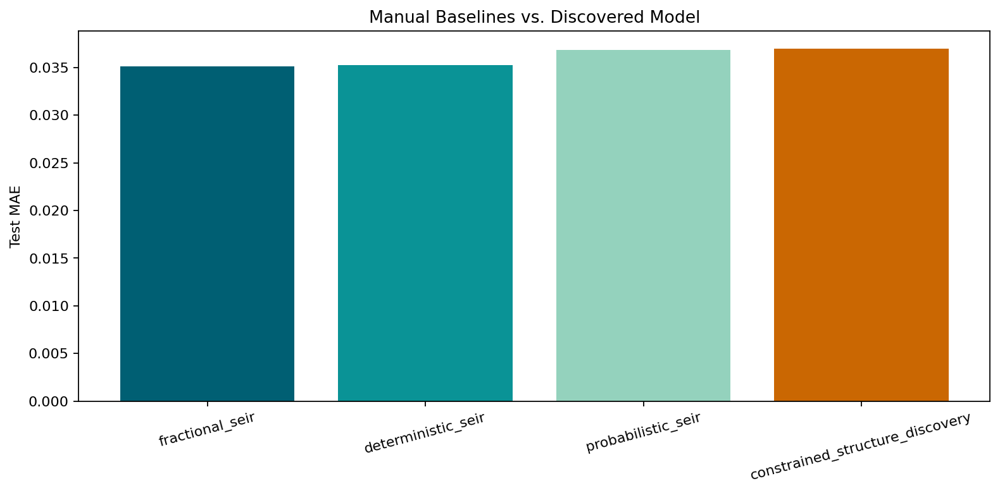
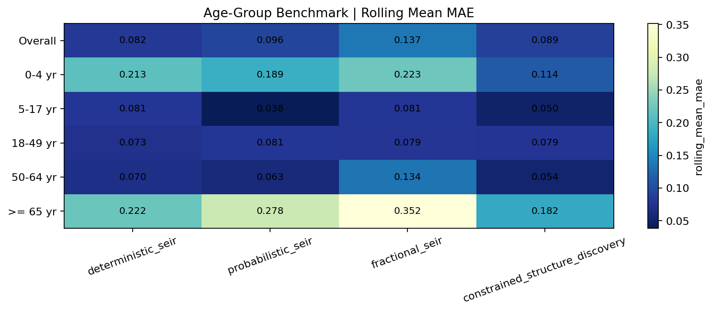
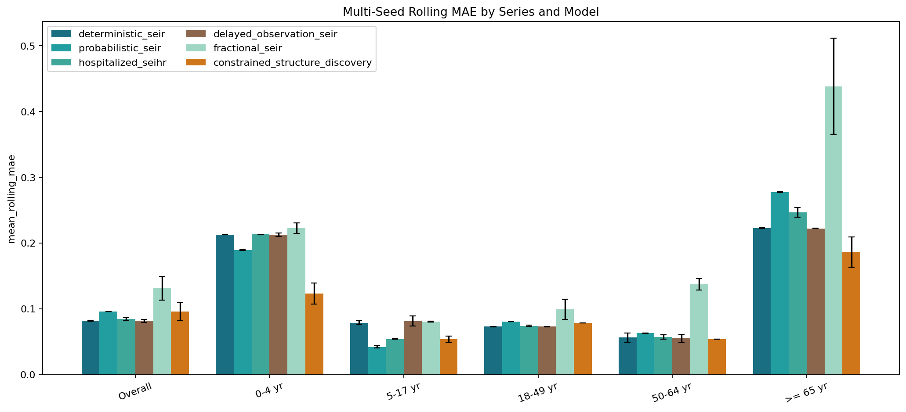
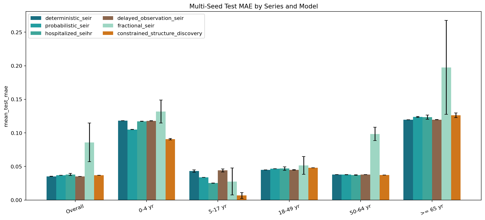
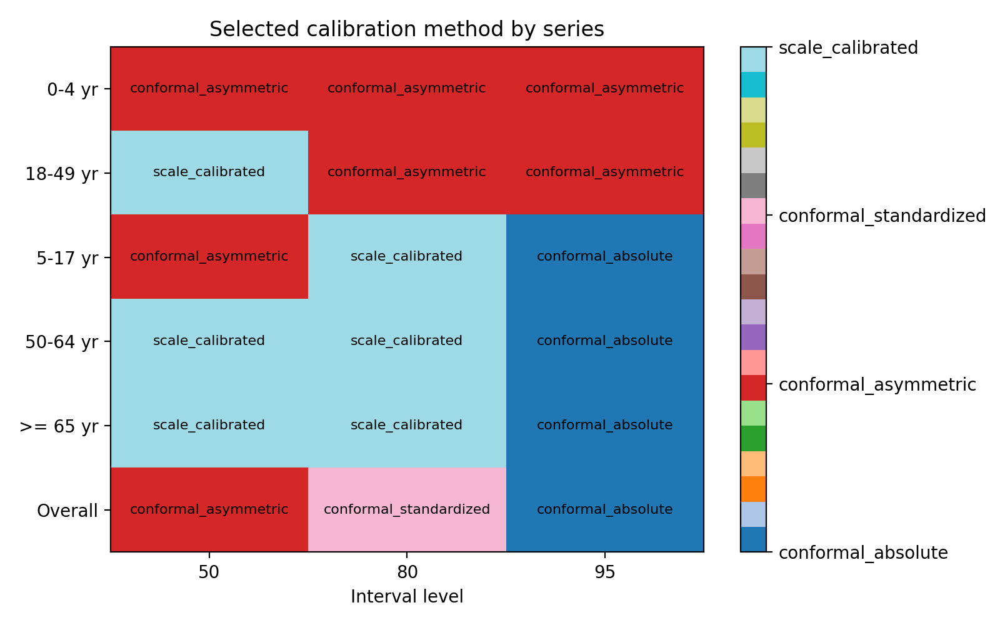
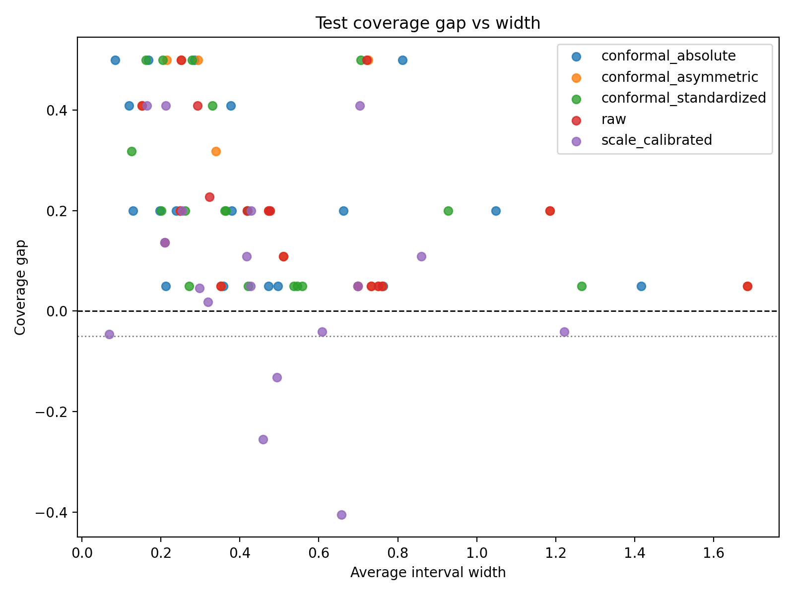

# agentic_flu_model_discovery

Reproducible Python benchmark for weekly influenza hospitalization-rate forecasting and constrained epidemic-model structure discovery from a FluSurv-NET CSV export.

This repository implements a proof-of-concept forecasting benchmark that compares standard hand-specified compartmental models against a constrained, programmatic structure-discovery loop. The goal is not to build a full agent-based simulator or use an LLM inside model fitting. Instead, the project asks a narrower and more practical question:

Can a reproducible propose-fit-verify-refine search over a small epidemic-model grammar discover useful structure for short-horizon weekly hospitalization-rate forecasting?

## Abstract

This repository studies weekly influenza hospitalization-rate forecasting with interpretable epidemic models under a fully reproducible benchmarking pipeline. Using a FluSurv-NET CSV export, the project compares four model families: a manual deterministic SEIR baseline, a manual probabilistic SEIR with Student-t observations, a manual fractional SEIR, and a constrained structure-discovery procedure over a small epidemic-model grammar. The discovery procedure is programmatic rather than language-model-driven: candidate structures are proposed, checked against biological validity rules, fit to data, ranked on rolling-origin validation behavior, and refined iteratively. On the current proof-of-concept season, the overall series is still best served by strong manual baselines, but constrained discovery is clearly useful for selected age groups. The main practical conclusion is that age-aware model selection and stability-aware discovery are more promising than pursuing a single globally best model family.

## Key Findings

- After making observation structure first-class in discovery and rerunning the five-seed benchmark, `0-4 yr` remains the clearest stable win for `constrained_structure_discovery`.
- Discovery now selects `delayed_I` observation maps in children and older adults, but it does not select `H` or `I+H` in the current season-level benchmark.
- `Overall` is now best served on held-out test MAE by `delayed_observation_seir`, while `18-49 yr` and `50-64 yr` are more competitive for stronger manual hospitalization-aware baselines than they were in the earlier grammar.
- `5-17 yr` and `>= 65 yr` remain split-sensitive: discovery often proposes semantically richer delayed-observation structures, but the rolling-origin winner is still different from the held-out test winner.
- Observation-aware five-seed no-age-prior ablation shows no change in recommended models, selected discovery structures, selected observation maps, delay modes, or aggregate discovery MAE, suggesting the observed delayed-observation pattern is not being trivially forced by the age prior.
- A tie-aware objective-policy summary shows that `4/6` age groups have different held-out-test and rolling-origin preferences, so several series are better described as practical ties or objective-dependent choices than as single-model wins.
- The main repository claim is now age-aware model selection under structural and observation uncertainty, not a single globally best model family or a single globally best observation map.

## Result Preview

Overall-series model comparison:



Age-group rolling-origin MAE heatmap:



Observation-aware five-seed robustness summary:



Observation-aware five-seed test MAE summary:



## Quick Start

Install dependencies:

```bash
pip install -r requirements.txt
```

Run the main benchmark:

```bash
python run_experiment.py --config configs/default.yaml
```

Run the age-group robustness benchmark:

```bash
python run_experiment.py --config configs/age_robustness.yaml --log-level INFO
```

Run the age-prior ablation variants:

```bash
python run_experiment.py --config configs/age_robustness_age_prior.yaml --log-level INFO
python run_experiment.py --config configs/age_robustness_no_age_prior.yaml --log-level INFO
python scripts/build_age_prior_ablation_summary.py
```

Run the 5-seed robustness aggregation:

```bash
python scripts/run_multiseed_benchmark.py --config configs/age_robustness_multiseed.yaml --log-level INFO --skip-existing
```

The multi-seed runner writes:

- `multiseed_model_summary.csv`
- `multiseed_age_group_recommendation.csv`
- `multiseed_discovery_structure_frequency.csv`
- `multiseed_test_mae_errorbars.png`
- `multiseed_rolling_mae_errorbars.png`

Run the observation-aware five-seed robustness benchmark in a fresh output root:

```bash
python scripts/run_multiseed_benchmark.py --config configs/age_robustness_multiseed_observation.yaml --log-level INFO --skip-existing
python scripts/run_multiseed_benchmark.py --config configs/age_robustness_multiseed_observation.yaml --aggregate-only
```

Run the observation-aware five-seed no-age-prior comparison:

```bash
python scripts/run_multiseed_benchmark.py --config configs/age_robustness_multiseed_observation_no_age_prior.yaml --log-level INFO --skip-existing
python scripts/run_multiseed_benchmark.py --config configs/age_robustness_multiseed_observation_no_age_prior.yaml --aggregate-only
python scripts/build_multiseed_observation_age_prior_ablation.py
```

Build tie-aware and objective-aware policy outputs for the observation-aware five-seed benchmark:

```bash
python scripts/build_objective_aware_policy.py --input-root artifacts_multiseed_age_robustness_observation --report-path reports/objective_aware_policy_report.md
```

Run benchmark-level conformal calibration postprocessing after the benchmark artifacts exist:

```bash
python scripts/run_conformal_postprocess.py --config configs/age_robustness.yaml --artifact-root artifacts_age_robustness --output-root artifacts_v5_conformal_v3 --log-level INFO
```

Build the `v1/v2/v3` winner-rule comparison table:

```bash
python scripts/build_conformal_rule_comparison.py
```

Run the test suite:

```bash
pytest tests -q
```

If you only want the most important outputs after a run, start here:

- overall leaderboard: [`artifacts/benchmark_leaderboard.csv`](artifacts/benchmark_leaderboard.csv)
- age-group winners: [`artifacts_age_robustness/benchmark_series_winners.csv`](artifacts_age_robustness/benchmark_series_winners.csv)
- age-aware recommendation table: [`artifacts_age_robustness/age_group_recommendation.csv`](artifacts_age_robustness/age_group_recommendation.csv)
- rolling-origin heatmap: [`artifacts_age_robustness/benchmark_rolling_mae_heatmap.png`](artifacts_age_robustness/benchmark_rolling_mae_heatmap.png)
- conformal comparison table: [`artifacts_v5_conformal_v3/probabilistic_calibration_comparison.csv`](artifacts_v5_conformal_v3/probabilistic_calibration_comparison.csv)
- conformal rule comparison table: [`artifacts_v5_conformal_v3/conformal_rule_comparison.csv`](artifacts_v5_conformal_v3/conformal_rule_comparison.csv)
- age-prior ablation summary: [`artifacts_age_prior_ablation/age_prior_ablation_summary.csv`](artifacts_age_prior_ablation/age_prior_ablation_summary.csv)
- multi-seed model summary: [`artifacts_multiseed_age_robustness/multiseed_model_summary.csv`](artifacts_multiseed_age_robustness/multiseed_model_summary.csv)
- multi-seed recommendation summary: [`artifacts_multiseed_age_robustness/multiseed_age_group_recommendation.csv`](artifacts_multiseed_age_robustness/multiseed_age_group_recommendation.csv)
- multi-seed structure frequency: [`artifacts_multiseed_age_robustness/multiseed_discovery_structure_frequency.csv`](artifacts_multiseed_age_robustness/multiseed_discovery_structure_frequency.csv)
- observation-aware multi-seed model summary: [`artifacts_multiseed_age_robustness_observation/multiseed_model_summary.csv`](artifacts_multiseed_age_robustness_observation/multiseed_model_summary.csv)
- observation-aware multi-seed recommendation summary: [`artifacts_multiseed_age_robustness_observation/multiseed_age_group_recommendation.csv`](artifacts_multiseed_age_robustness_observation/multiseed_age_group_recommendation.csv)
- observation-aware multi-seed structure frequency: [`artifacts_multiseed_age_robustness_observation/multiseed_discovery_structure_frequency.csv`](artifacts_multiseed_age_robustness_observation/multiseed_discovery_structure_frequency.csv)
- observation-aware objective-aware policy: [`artifacts_multiseed_age_robustness_observation/multiseed_objective_policy.csv`](artifacts_multiseed_age_robustness_observation/multiseed_objective_policy.csv)
- observation-aware pairwise model differences: [`artifacts_multiseed_age_robustness_observation/pairwise_model_differences.csv`](artifacts_multiseed_age_robustness_observation/pairwise_model_differences.csv)
- observation-aware age-prior ablation summary: [`artifacts_multiseed_observation_age_prior_ablation/multiseed_age_prior_ablation_summary.csv`](artifacts_multiseed_observation_age_prior_ablation/multiseed_age_prior_ablation_summary.csv)
- observation-aware age-prior structure comparison: [`artifacts_multiseed_observation_age_prior_ablation/multiseed_age_prior_structure_comparison.csv`](artifacts_multiseed_observation_age_prior_ablation/multiseed_age_prior_structure_comparison.csv)
- observation-aware age-prior model delta: [`artifacts_multiseed_observation_age_prior_ablation/multiseed_age_prior_model_delta.csv`](artifacts_multiseed_observation_age_prior_ablation/multiseed_age_prior_model_delta.csv)
- conformal phase report: [`reports/conformal_v5_report.md`](reports/conformal_v5_report.md)
- current phase summary: [`reports/phase2_status_report.md`](reports/phase2_status_report.md)
- fair-baseline and multi-seed report: [`reports/multiseed_fair_baseline_report.md`](reports/multiseed_fair_baseline_report.md)
- observation-structure report: [`reports/observation_structure_multiseed_report.md`](reports/observation_structure_multiseed_report.md)
- observation-aware age-prior ablation report: [`reports/multiseed_observation_age_prior_ablation_report.md`](reports/multiseed_observation_age_prior_ablation_report.md)
- objective-aware policy report: [`reports/objective_aware_policy_report.md`](reports/objective_aware_policy_report.md)

## Benchmark-Level Conformal Calibration

Conformal calibration is implemented as a benchmark-level post-processing stage over existing probabilistic forecast artifacts. It does not refit models or alter point forecasts.

The main benchmark now treats probabilistic interval generation and conformal calibration as two separate stages:

- the benchmark run writes raw probabilistic forecasts, including `validation_forecast_trace.csv`
- the conformal postprocess reads those raw artifacts and applies benchmark-level calibration afterward

When benchmark-level conformal is enabled in the config, fitting-level interval calibration is disabled to avoid double calibration.

The postprocess compares five calibration kinds:

- `raw`
- `scale_calibrated`
- `conformal_absolute`
- `conformal_standardized`
- `conformal_asymmetric`

Winner selection is based on validation rows only. Test rows are evaluation-only and cannot influence calibration-method selection.

The conformal residual bank is benchmark-level rather than series-local. It can prefer horizon-specific rolling validation residuals, then fall back to pooled horizons, age-family pooling, and finally global pooling when calibration counts are too small.

The current postprocess expects leakage-free probabilistic validation artifacts written by the current benchmark pipeline, including `validation_forecast_trace.csv` inside each `probabilistic_seir` artifact directory. If those files are missing, rerun the benchmark first and then rerun the conformal postprocess.

The current recommended conformal outputs are under [`artifacts_v5_conformal_v3/`](artifacts_v5_conformal_v3).

The current default winner-selection rule is the `v3` balanced rule:

- filter out methods with validation `coverage_gap < -0.05`
- then minimize `normalized_abs_coverage_gap + 0.25 * normalized_interval_score`
- then minimize interval width
- if all methods violate the floor, fall back to the same balanced score without the floor

`v3` is the current default because it preserves nearly the same coverage error as `v2` while substantially improving interval score and width.

A detailed conformal write-up is available in [`reports/conformal_v5_report.md`](reports/conformal_v5_report.md), and a broader benchmark-plus-conformal status report is available in [`reports/phase2_status_report.md`](reports/phase2_status_report.md).

Selected conformal result previews:





## LLM-V0

LLM-V0 is a proposal-only layer.
It does not perform iterative refinement.
It does not make final scientific claims from mock-provider results.
It is intended to validate schema, leakage guards, hard validation, candidate execution, and comparison against non-LLM discovery.

Mock provider results are engineering smoke tests and should not be interpreted as evidence of LLM reasoning quality.

The LLM layer does not fit parameters, does not write Python equations, and does not change the existing non-LLM benchmark. It only proposes and critiques `StructureSpec` candidates, which then pass through the existing hard validator and numerical executor.

Run a one-series smoke test:

```bash
python scripts/run_llm_structure_search.py --config configs/llm_v0.yaml --series "0-4 yr" --provider mock --log-level INFO
```

Run all series in mock mode:

```bash
python scripts/run_llm_structure_search.py --config configs/llm_v0.yaml --all-series --provider mock --log-level INFO
```

The main outputs are:

- `artifacts_llm_v0/{series_slug}/proposal_audit.csv`
- `artifacts_llm_v0/{series_slug}/llm_leaderboard.csv`
- `artifacts_llm_v0/{series_slug}/llm_vs_nonllm_summary.csv`
- `artifacts_llm_v0/llm_vs_nonllm_summary.csv`
- `artifacts_llm_v0/llm_valid_proposal_rate.csv`
- `artifacts_llm_v0/llm_candidate_efficiency.csv`
- `artifacts_llm_v0/llm_semantic_alignment.csv`
- `reports/llm_v0_report.md`

## LLM-V1

LLM-V1 adds iterative refinement on top of the LLM-V0 proposal-only layer.
It still does not fit parameters, does not write Python equations, and does not change the existing non-LLM benchmark.
The repository now supports both `provider=mock` and `provider=openai` for LLM-V1 runs.
The frozen mock-provider artifact root remains the engineering validation baseline, while the clean two-series OpenAI smoke root is the first live-provider protocol check.

Mock provider results are engineering smoke tests and should not be interpreted as evidence of LLM reasoning quality.
Live-provider results are controlled preliminary evaluations. The all-series freeze now provides an audited live-provider run, but candidate budgets are not matched and the result should not be read as a global LLM-over-non-LLM win.

The V1 loop is:

```text
round 1:
summary -> semantics -> proposer -> critic -> hard validator -> executor

round 2+:
analyst -> proposer refinement -> critic -> hard validator -> executor
```

Selection and early stopping use validation and rolling metrics only. Test metrics are computed only after the final validation-selected candidate is fixed.

Run a one-series V1 smoke test:

```bash
python scripts/run_llm_iterative_refinement.py --config configs/llm_v1_iterative.yaml --series ">= 65 yr" --provider mock --log-level INFO
```

Run all series in V1 mock mode:

```bash
python scripts/run_llm_iterative_refinement.py --config configs/llm_v1_iterative.yaml --all-series --provider mock --log-level INFO
```

Environment setup:

```bash
cp .env.example .env
```

Then fill in `OPENAI_API_KEY` in `.env`.

Run the two-series live-provider smoke test in a separate artifact root:

```bash
python scripts/run_llm_iterative_refinement.py \
  --config configs/llm_v1_iterative_openai_two_series_smoke.yaml \
  --series "5-17 yr" \
  --series ">= 65 yr" \
  --provider openai \
  --log-level INFO
```

Then rebuild and validate the live-provider smoke report:

```bash
python scripts/build_llm_v1_report.py \
  --config configs/llm_v1_iterative_openai_two_series_smoke.yaml \
  --artifact-root artifacts_llm_v1_openai_two_series_smoke \
  --output reports/llm_v1_openai_two_series_smoke_report.md

python scripts/validate_llm_v1_artifacts.py \
  --artifact-root artifacts_llm_v1_openai_two_series_smoke \
  --iterative-report reports/llm_v1_openai_two_series_smoke_report.md \
  --report reports/llm_v1_openai_two_series_smoke_artifact_validation_report.md
```

Live-provider runs should still be treated as controlled evaluation runs rather than automatic scientific claims. The clean two-series live-provider smoke outputs are frozen as a protocol check, while all-series live-provider outputs should be frozen only after they are explicitly rerun, validated, and reported under the same protocol.

The clean two-series live-provider smoke freeze is stored under:

- [`artifacts_llm_v1_openai_two_series_smoke/`](artifacts_llm_v1_openai_two_series_smoke/)
- [`reports/llm_v1_openai_two_series_smoke_report.md`](reports/llm_v1_openai_two_series_smoke_report.md)
- [`reports/llm_v1_openai_two_series_smoke_artifact_validation_report.md`](reports/llm_v1_openai_two_series_smoke_artifact_validation_report.md)

This run passed the artifact/leakage validator on two difficult series, `5-17 yr` and `>= 65 yr`.
For `5-17 yr`, V1 selected `SEIRS|fractional=0|obs=delayed_I|delay=1` after round-two refinement.
For `>= 65 yr`, V1 selected `SEIRS|fractional=1|obs=delayed_I|delay=1` in round one.
Candidate budgets are not matched, so these outputs should not be interpreted as candidate-efficiency evidence.

Run an all-series live-provider freeze in a separate artifact root:

```bash
python scripts/run_llm_iterative_refinement.py \
  --config configs/llm_v1_iterative_openai_all_series_freeze.yaml \
  --all-series \
  --provider openai \
  --log-level INFO
```

Then rebuild and validate the all-series live report against the matching artifact root before using it in paper-level claims.

The clean all-series live-provider freeze is stored under:

- [`artifacts_llm_v1_openai_all_series_freeze/`](artifacts_llm_v1_openai_all_series_freeze/)
- [`reports/llm_v1_openai_all_series_freeze_report.md`](reports/llm_v1_openai_all_series_freeze_report.md)
- [`reports/llm_v1_openai_all_series_freeze_artifact_validation_report.md`](reports/llm_v1_openai_all_series_freeze_artifact_validation_report.md)

This all-series run passed artifact/leakage validation across six series, 15 rounds, and 171 checked files.
V1 improved over the V0 score for `0-4 yr`, `5-17 yr`, and `>= 65 yr`, but improved over the non-LLM reference score only for `0-4 yr`.
The correct interpretation is that live V1 is operational and sometimes useful, while the observation-aware non-LLM discovery baseline remains the stronger overall reference.

Rebuild the V1 markdown report from existing artifacts:

```bash
python scripts/build_llm_v1_report.py \
  --config configs/llm_v1_iterative.yaml \
  --artifact-root artifacts_llm_v1 \
  --output reports/llm_v1_iterative_report.md
```

The main V1 outputs are:

- `artifacts_llm_v1/{series_slug}/rounds/round_*/proposal_audit.csv`
- `artifacts_llm_v1/{series_slug}/rounds/round_*/llm_leaderboard.csv`
- `artifacts_llm_v1/{series_slug}/llm_refinement_trace.jsonl`
- `artifacts_llm_v1/{series_slug}/llm_refinement_trace.md`
- `artifacts_llm_v1/{series_slug}/final_selected_test_report.csv`
- `artifacts_llm_v1/llm_v1_vs_v0_vs_nonllm_summary.csv`
- `artifacts_llm_v1/llm_v1_valid_proposal_rate_by_round.csv`
- `artifacts_llm_v1/llm_v1_candidate_efficiency.csv`
- `artifacts_llm_v1/llm_v1_refinement_improvement.csv`
- `artifacts_llm_v1/llm_v1_semantic_alignment.csv`
- `reports/llm_v1_iterative_report.md`

## Key Files

The repository contains many artifacts, but these files are the fastest path to understanding the current benchmark.

### Code Entry Points

- main CLI: [`run_experiment.py`](run_experiment.py)
- default config: [`configs/default.yaml`](configs/default.yaml)
- age-robustness config: [`configs/age_robustness.yaml`](configs/age_robustness.yaml)
- discovery search logic: [`src/discovery/search.py`](src/discovery/search.py)
- evaluation pipeline: [`src/evaluation/pipeline.py`](src/evaluation/pipeline.py)
- reporting utilities: [`src/evaluation/reporting.py`](src/evaluation/reporting.py)

### Primary Result Tables

- overall benchmark ranking: [`artifacts/benchmark_leaderboard.csv`](artifacts/benchmark_leaderboard.csv)
- age-group model summary: [`artifacts_age_robustness/benchmark_model_summary.csv`](artifacts_age_robustness/benchmark_model_summary.csv)
- age-group winners: [`artifacts_age_robustness/benchmark_series_winners.csv`](artifacts_age_robustness/benchmark_series_winners.csv)
- recommended model by age group: [`artifacts_age_robustness/age_group_recommendation.csv`](artifacts_age_robustness/age_group_recommendation.csv)
- multi-seed model summary: [`artifacts_multiseed_age_robustness/multiseed_model_summary.csv`](artifacts_multiseed_age_robustness/multiseed_model_summary.csv)
- multi-seed recommendation summary: [`artifacts_multiseed_age_robustness/multiseed_age_group_recommendation.csv`](artifacts_multiseed_age_robustness/multiseed_age_group_recommendation.csv)
- age-prior ablation summary: [`artifacts_age_prior_ablation/age_prior_ablation_summary.csv`](artifacts_age_prior_ablation/age_prior_ablation_summary.csv)
- latest observation-aware multi-seed summary: [`artifacts_multiseed_age_robustness_observation/multiseed_model_summary.csv`](artifacts_multiseed_age_robustness_observation/multiseed_model_summary.csv)
- latest observation-aware recommendation summary: [`artifacts_multiseed_age_robustness_observation/multiseed_age_group_recommendation.csv`](artifacts_multiseed_age_robustness_observation/multiseed_age_group_recommendation.csv)
- latest observation-aware structure frequency: [`artifacts_multiseed_age_robustness_observation/multiseed_discovery_structure_frequency.csv`](artifacts_multiseed_age_robustness_observation/multiseed_discovery_structure_frequency.csv)
- latest observation-aware objective-aware policy: [`artifacts_multiseed_age_robustness_observation/multiseed_objective_policy.csv`](artifacts_multiseed_age_robustness_observation/multiseed_objective_policy.csv)
- latest observation-aware pairwise differences: [`artifacts_multiseed_age_robustness_observation/pairwise_model_differences.csv`](artifacts_multiseed_age_robustness_observation/pairwise_model_differences.csv)
- observation-aware no-age-prior ablation summary: [`artifacts_multiseed_observation_age_prior_ablation/multiseed_age_prior_ablation_summary.csv`](artifacts_multiseed_observation_age_prior_ablation/multiseed_age_prior_ablation_summary.csv)
- observation-aware no-age-prior ablation report: [`reports/multiseed_observation_age_prior_ablation_report.md`](reports/multiseed_observation_age_prior_ablation_report.md)
- LLM-V0 comparison summary: [`artifacts_llm_v0/llm_vs_nonllm_summary.csv`](artifacts_llm_v0/llm_vs_nonllm_summary.csv)
- LLM-V1 comparison summary: [`artifacts_llm_v1/llm_v1_vs_v0_vs_nonllm_summary.csv`](artifacts_llm_v1/llm_v1_vs_v0_vs_nonllm_summary.csv)
- LLM-V1 iterative report: [`reports/llm_v1_iterative_report.md`](reports/llm_v1_iterative_report.md)
- clean two-series live-provider LLM-V1 report: [`reports/llm_v1_openai_two_series_smoke_report.md`](reports/llm_v1_openai_two_series_smoke_report.md)
- clean two-series live-provider artifact validation: [`reports/llm_v1_openai_two_series_smoke_artifact_validation_report.md`](reports/llm_v1_openai_two_series_smoke_artifact_validation_report.md)
- clean all-series live-provider LLM-V1 report: [`reports/llm_v1_openai_all_series_freeze_report.md`](reports/llm_v1_openai_all_series_freeze_report.md)
- clean all-series live-provider artifact validation: [`reports/llm_v1_openai_all_series_freeze_artifact_validation_report.md`](reports/llm_v1_openai_all_series_freeze_artifact_validation_report.md)

### Discovery Outputs

- overall best discovered structure: [`artifacts/overall/constrained_structure_discovery/best_model_spec.json`](artifacts/overall/constrained_structure_discovery/best_model_spec.json)
- overall discovery leaderboard: [`artifacts/overall/constrained_structure_discovery/leaderboard.csv`](artifacts/overall/constrained_structure_discovery/leaderboard.csv)
- age-group discovery winner example: [`artifacts_age_robustness/robustness/0_4_yr/constrained_structure_discovery/best_model_spec.json`](artifacts_age_robustness/robustness/0_4_yr/constrained_structure_discovery/best_model_spec.json)

### Plots Worth Opening First

- overall model comparison: [`artifacts/overall/model_comparison.png`](artifacts/overall/model_comparison.png)
- age-group test MAE heatmap: [`artifacts_age_robustness/benchmark_test_mae_heatmap.png`](artifacts_age_robustness/benchmark_test_mae_heatmap.png)
- age-group rolling MAE heatmap: [`artifacts_age_robustness/benchmark_rolling_mae_heatmap.png`](artifacts_age_robustness/benchmark_rolling_mae_heatmap.png)
- multi-seed test MAE error bars: [`artifacts_multiseed_age_robustness/multiseed_test_mae_errorbars.png`](artifacts_multiseed_age_robustness/multiseed_test_mae_errorbars.png)
- multi-seed rolling MAE error bars: [`artifacts_multiseed_age_robustness/multiseed_rolling_mae_errorbars.png`](artifacts_multiseed_age_robustness/multiseed_rolling_mae_errorbars.png)
- latest observation-aware multi-seed test MAE error bars: [`artifacts_multiseed_age_robustness_observation/multiseed_test_mae_errorbars.png`](artifacts_multiseed_age_robustness_observation/multiseed_test_mae_errorbars.png)
- latest observation-aware multi-seed rolling MAE error bars: [`artifacts_multiseed_age_robustness_observation/multiseed_rolling_mae_errorbars.png`](artifacts_multiseed_age_robustness_observation/multiseed_rolling_mae_errorbars.png)
- per-series example forecast plot: [`artifacts_age_robustness/robustness/50_64_yr/model_comparison.png`](artifacts_age_robustness/robustness/50_64_yr/model_comparison.png)

## Why This Repository Exists

Epidemic forecasting projects often face a tradeoff between simple, interpretable compartmental models and highly flexible models that are difficult to audit or reproduce. This project is designed to sit in between those extremes.

It provides:

- a clean, end-to-end benchmark for weekly FluSurv-NET hospitalization-rate forecasting
- direct comparisons among deterministic, probabilistic, fractional, and discovered epidemic models
- a constrained "agentic" structure-discovery loop with explicit biological validity checks
- reproducible outputs, plots, metrics, and tests that can be rerun from one command

The repository is intentionally scoped as a single-season proof of concept. It is meant to be extended later to multiple seasons, multiple catchments, or richer hierarchical settings.

## What "Agentic" Means Here

In this repository, "agentic" does not mean an LLM is choosing equations during training.

The agentic component is a deterministic program loop:

1. propose a candidate epidemic structure
2. verify the candidate against explicit structural rules
3. fit the candidate to data
4. score the candidate on validation-time forecasting behavior
5. keep the strongest candidates in a beam
6. refine by exploring local structural edits

This gives a search process that is transparent, reproducible, and auditable.

## Benchmark Overview

The benchmark compares four core model families:

1. `deterministic_seir`
2. `probabilistic_seir`
3. `fractional_seir`
4. `constrained_structure_discovery`

The current benchmark also includes two manual hospitalization-aware baselines:

5. `hospitalized_seihr`
6. `delayed_observation_seir`

The core forecasting task is weekly hospitalization-rate prediction from a FluSurv-NET CSV using chronological train, validation, and test splits plus rolling-origin forecasting at horizons 1, 2, and 4 weeks.

### Primary Research Question

Does constrained epidemic-model structure discovery provide useful forecasting gains relative to strong manual baselines, and if so, for which age groups and under what stability criteria?

### Main Design Principles

- normalized population units with total mass near `1.0`
- latent epidemic states with a learned observation scaling coefficient `rho`
- non-negativity constraints for compartments
- mass-conservation penalties for models without deaths
- multiple random restarts for fitting
- fixed global seed `42`
- artifact-first workflow with all outputs written to disk

## Data Pipeline

The input data are expected to be a FluSurv-NET CSV export.

The benchmark performs the following preprocessing steps:

- reads the file with `skiprows=2`
- drops disclaimer/footer rows with missing `WEEK` or missing `YEAR.1`
- sorts rows by `YEAR.1` and then `WEEK`
- creates a continuous integer time index `t = 0, 1, ..., T-1`

### Primary Series Filter

The main benchmark series uses:

- `CATCHMENT == "Entire Network"`
- `AGE CATEGORY == "Overall"`
- `SEX CATEGORY == "Overall"`
- `RACE CATEGORY == "Overall"`
- `VIRUS TYPE CATEGORY == "Overall"`
- target column `WEEKLY RATE`

### Optional Age-Group Robustness

The same pipeline is also implemented for:

- `0-4 yr`
- `5-17 yr`
- `18-49 yr`
- `50-64 yr`
- `>= 65 yr`

while keeping the remaining categories at `Overall`.

## Models

### 1. Manual Deterministic SEIR

This is the baseline compartmental model with weekly discrete updates over `S`, `E`, `I`, and `R`.

The transmission rate is seasonal:

`beta_t = softplus(b0 + b1*sin(2*pi*t/52) + b2*cos(2*pi*t/52))`

The observation model is:

`y_hat[t] = rho * I[t]`

Fitting uses mean squared error plus penalties for negative states and mass-conservation violations.

### 2. Manual Probabilistic SEIR

This model shares the same latent SEIR dynamics as the deterministic baseline but uses a Student-t observation model:

`y[t] ~ StudentT(df=5, loc=rho * I[t], scale=s)`

The implementation fits by MAP estimation and then generates predictive intervals. The code supports both:

- Laplace approximation
- bootstrap predictive uncertainty

The default configs now use bootstrap intervals.

### 3. Manual Fractional SEIR

This model keeps the same `S`, `E`, `I`, `R` compartments but adds a shared fractional order `alpha` constrained to `0.7 <= alpha <= 1.0`.

The current implementation uses a Caputo-style L1 discrete-memory approximation as a stable numerical baseline.

### 4. Constrained Structure Discovery

This is the main experimental component.

The search space includes:

- `SIR`
- `SEIR`
- `SEIRS`
- `SEIHR`
- `SEIAR`

with toggles for:

- fractional on or off
- observation map `I`, `H`, `I+H`, or `delayed_I`
- observation delay `delay_weeks in {1, 2, 3}` when `observation_map=delayed_I`

Observation map and delay are first-class structural choices. They represent observation uncertainty: the hospitalization-rate target may align best with a latent infectious proxy, a hospitalization compartment, a combined infectious-plus-hospitalized proxy, or a lagged infectious proxy.

Candidate structures are filtered through explicit validity rules such as:

- infection must originate from `S`
- infectious-like compartments must eventually lead to `R`
- no isolated compartments
- no biologically nonsensical self-loops
- maximum of 5 compartments
- approximate conservation of total mass

The discovery score is built from:

- rolling-origin validation performance
- model-complexity penalties
- a rolling-error stability penalty
- age-aware structure priors

The result is a controlled search that favors structures that are not only accurate on one split, but also reasonably stable.

## Evaluation Protocol

### Chronological Split

Each series is partitioned in order:

- first `60%` for train
- next `20%` for validation
- final `20%` for test

### Rolling-Origin Forecasting

The benchmark also evaluates expanding-window forecasts for:

- 1 week ahead
- 2 weeks ahead
- 4 weeks ahead

### Point Forecast Metrics

- MAE
- RMSE
- sMAPE

### Probabilistic Metrics

- negative log-likelihood
- 80% interval coverage
- 95% interval coverage
- average interval width

## Current Headline Results

The repository already contains benchmark outputs from the current proof-of-concept season.

### Overall Series

From [`artifacts/benchmark_leaderboard.csv`](artifacts/benchmark_leaderboard.csv):

| Model | Test MAE | Test RMSE | Free Params | Compartments |
| --- | ---: | ---: | ---: | ---: |
| `fractional_seir` | `0.03511` | `0.04106` | 9 | 4 |
| `deterministic_seir` | `0.03523` | `0.04128` | 8 | 4 |
| `probabilistic_seir` | `0.03682` | `0.04443` | 9 | 4 |
| `constrained_structure_discovery` | `0.03697` | `0.04466` | 6 | 3 |

Interpretation:

- the main series is still well served by a strong manual baseline
- discovery is competitive, but not the top performer on this held-out overall split
- the fractional baseline can be very strong on the final overall test split, but was less stable across rolling-origin validation

### Age-Group Robustness

From [`artifacts_age_robustness/benchmark_series_winners.csv`](artifacts_age_robustness/benchmark_series_winners.csv) and [`artifacts_age_robustness/age_group_recommendation.csv`](artifacts_age_robustness/age_group_recommendation.csv):

| Series | Best Test Model | Best Rolling Model | Recommended Model | Decision Type |
| --- | --- | --- | --- | --- |
| `Overall` | `deterministic_seir` | `deterministic_seir` | `deterministic_seir` | `consensus` |
| `0-4 yr` | `constrained_structure_discovery` | `constrained_structure_discovery` | `constrained_structure_discovery` | `consensus` |
| `5-17 yr` | `constrained_structure_discovery` | `probabilistic_seir` | `probabilistic_seir` | `stability_preferred` |
| `18-49 yr` | `deterministic_seir` | `deterministic_seir` | `deterministic_seir` | `consensus` |
| `50-64 yr` | `constrained_structure_discovery` | `constrained_structure_discovery` | `constrained_structure_discovery` | `consensus` |
| `>= 65 yr` | `deterministic_seir` | `constrained_structure_discovery` | `deterministic_seir` | `test_preferred` |

This is the most important empirical takeaway so far:

- discovery is not a universal replacement for hand-built models
- discovery is clearly useful for some age groups
- the best strategy is age-aware model selection rather than forcing a single model family to win everywhere

### Practical Summary of the Results

At the current stage, the repository supports the following conclusion:

Constrained structure discovery already shows meaningful value in selected age groups, but the strongest next step is age-aware model selection and stability-aware discovery, not simply increasing model complexity everywhere.

## Repository Layout

```text
agentic_flu_model_discovery/
  data/
    raw/
    processed/
    processed_age_robustness/
  src/
    data/
    discovery/
    evaluation/
    models/
    plotting/
    utils/
  configs/
  artifacts/
  artifacts_age_robustness/
  tests/
  run_experiment.py
  README.md
  requirements.txt
```

## Installation

Install the Python dependencies:

```bash
pip install -r requirements.txt
```

If you are using the shared environment from development, the verified interpreter was:

```bash
/home/zwang/miniconda3/envs/myenv2/bin/python
```

## Reproducing the Benchmark

### Run the Main Benchmark

```bash
python run_experiment.py --config configs/default.yaml
```

### Run the Age-Group Robustness Benchmark

```bash
python run_experiment.py --config configs/age_robustness.yaml
```

### Run with Explicit Logging

```bash
python run_experiment.py --config configs/age_robustness.yaml --log-level INFO
```

### Run the Unit Tests

```bash
pytest tests -q
```

### Verified Commands in the Shared Workspace

```bash
/home/zwang/miniconda3/envs/myenv2/bin/python run_experiment.py --config configs/default.yaml
/home/zwang/miniconda3/envs/myenv2/bin/python run_experiment.py --config configs/age_robustness.yaml --log-level INFO
/home/zwang/miniconda3/envs/myenv2/bin/python -m pytest tests -q
```

## Outputs

### Per-Model Outputs

Each fitted model writes a directory containing:

- `metrics.json`
- `forecast_trace.csv`
- `rolling_origin_forecasts.csv`
- `full_series_fit.png`
- `rolling_origin.png`
- `residuals.png`

The discovery model also writes:

- `leaderboard.csv`
- `leaderboard.png`
- `best_model_spec.json`
- `best_model_spec.yaml`
- `best_structure.png`

### Top-Level Summary Outputs

The repository writes benchmark-wide summaries such as:

- `artifacts/benchmark_leaderboard.csv`
- `artifacts/benchmark_model_summary.csv`
- `artifacts/benchmark_series_winners.csv`
- `artifacts/age_group_recommendation.csv`
- `artifacts/run_summary.json`

and for age robustness:

- `artifacts_age_robustness/benchmark_leaderboard.csv`
- `artifacts_age_robustness/benchmark_model_summary.csv`
- `artifacts_age_robustness/benchmark_series_winners.csv`
- `artifacts_age_robustness/age_group_recommendation.csv`
- `artifacts_age_robustness/benchmark_test_mae_heatmap.png`
- `artifacts_age_robustness/benchmark_rolling_mae_heatmap.png`

## Paper-Ready Supplementary Runs

Additional paper-support scripts are additive and write to new artifact roots by default:

- multi-season FluSurv-NET RESP-NET preparation: `python scripts/prepare_flusurvnet_multiseason_from_respnet.py --output data/raw/flusurvnet_multiseason_full.csv`
- multi-season FluSurv-NET audit: `python scripts/audit_flusurvnet_multiseason.py --csv data/raw/flusurvnet_multiseason_full.csv --output-dir data/processed_flusurvnet_multiseason --report reports/flusurvnet_multiseason_audit.md`
- season-separated multi-season FluSurv-NET benchmark: `python scripts/run_flusurvnet_multiseason_seasonal_benchmark.py --config configs/flusurvnet_multiseason_seasonal_selected.yaml --log-level INFO`
- selected-series OpenAI repeats: `python scripts/run_llm_v1_selected_repeats.py --repeat-ids 1 2 3`
- LLM-vs-nonLLM budget diagnostic: `python scripts/build_llm_budget_diagnostic.py --llm-root artifacts_llm_v1_openai_all_series_freeze --nonllm-root artifacts_multiseed_age_robustness_observation --output-root artifacts_llm_budget_diagnostic --report reports/llm_budget_diagnostic_report.md`
- dengue non-LLM weekly smoke benchmark: `python scripts/run_dengue_weekly_smoke.py --config configs/dengue_weekly_smoke.yaml`

The budget diagnostic is descriptive unless candidate order and scoring are both available and comparable at fixed K budgets. It must not be used to claim candidate efficiency or global LLM superiority when budgets/order are unmatched.
The multi-season FluSurv-NET seasonal benchmark evaluates each completed season as its own within-season trajectory. Use it as a cross-season robustness supplement, not as a direct previous-season-to-future-season transfer forecast.
Do not run selected OpenAI live repeats in CI; they require `OPENAI_API_KEY` and intentionally call the live provider.

## Configuration Guide

Main runtime controls live in [`configs/default.yaml`](configs/default.yaml) and [`configs/age_robustness.yaml`](configs/age_robustness.yaml).

Important knobs include:

- `fitting.n_restarts`: number of optimization restarts for the main fit
- `fitting.rolling_n_restarts`: restarts used during rolling-origin refits
- `fitting.maxiter`: optimizer iteration cap
- `fitting.uncertainty_method`: `laplace` or `bootstrap`
- `fitting.bootstrap_draws`: number of predictive bootstrap draws
- `fitting.bootstrap_n_restarts`: additional optimization restarts inside each bootstrap refit
- `evaluation.horizons`: rolling-origin horizons used for standard reporting
- `discovery.beam_width`: beam size in structure search
- `discovery.max_rounds`: maximum propose-fit-verify-refine rounds
- `discovery.patience`: early-stopping patience
- `discovery.rolling_horizons`: horizons used during discovery-time model ranking
- `discovery.score_param_weight`: penalty on the number of free parameters
- `discovery.score_compartment_weight`: penalty on the number of compartments
- `discovery.score_stability_weight`: penalty on unstable rolling-origin error behavior
- `discovery.age_prior_*`: light age-group priors over simpler, recurrent, or fractional structures
- `data.include_age_robustness`: toggle for rerunning all age-specific series
- `data.season_mode`: `pooled` concatenates selected seasons into one sequence and is for smoke/descriptive runs only; `separate` evaluates each FluSurv-NET season as its own series
- `data.seasons`: optional FluSurv-NET season labels, such as `2023-24`, used to subset the raw export

For paper-level multi-season claims, prefer `season_mode=separate` or an explicit season-level train/validation/test split over pooled mode.

## Testing

The test suite currently covers:

- data filtering
- time sorting
- season-aware FluSurv-NET processing
- dengue data normalization
- mass conservation checks
- deterministic SEIR forward simulation
- discovery-rule validation
- discovery scoring helpers
- reporting outputs
- LLM budget diagnostic guardrails
- probabilistic bootstrap uncertainty shape checks

## Limitations

This repository is intentionally narrow in scope.

Current limitations include:

- only one uploaded season is used in the current proof-of-concept benchmark
- the work does not establish broad epidemiological generalization
- discovery is still based on a small grammar rather than a large mechanistic search space
- the probabilistic model is useful but not yet the strongest point-forecast baseline
- fractional dynamics help in some settings but are not yet a universally stable winner

## Recommended Next Steps

The most valuable next extensions are:

- multi-season evaluation
- shared cross-age priors or hierarchical fitting
- stronger stability-aware discovery objectives
- calibration-focused probabilistic diagnostics
- broader grammar extensions with still-auditable biological constraints

## Reproducibility Notes

- global random seed is fixed at `42`
- all benchmark artifacts are written to disk
- the discovery loop is deterministic conditional on config and seed
- local testing in the shared workspace passed with `pytest`

## Citation and Use

If you reuse this repository, please cite the project URL and describe it as a proof-of-concept benchmark for constrained epidemic-model structure discovery on FluSurv-NET weekly hospitalization-rate forecasting.
